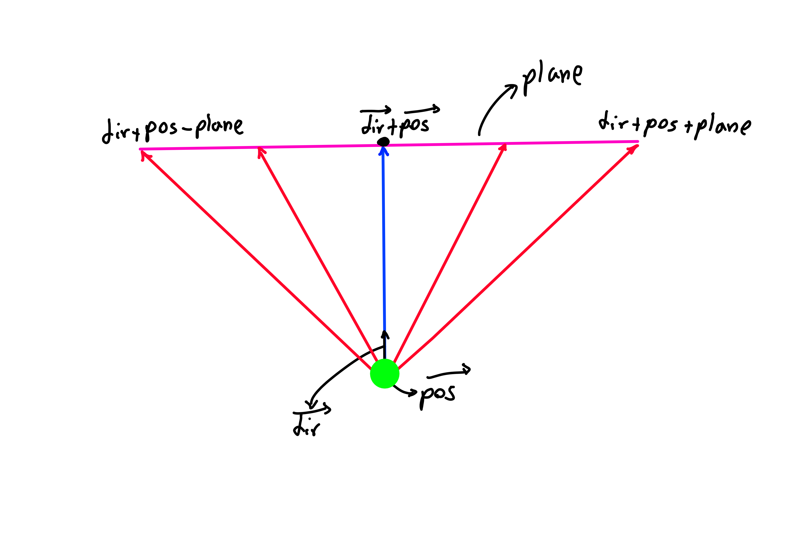
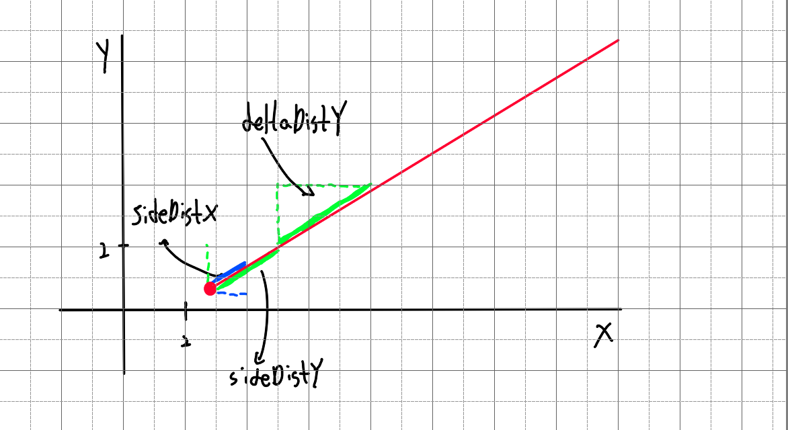

**Raycaster Engine**

A simple raycasting engine built from scratch using C++ and SDL2, inspired by the rendering techniques of early 3D games like Wolfenstein 3D. This project is designed to help understand the fundamentals of real-time 3D rendering and grid-based world navigation.

**Main Principle**
The engine uses the Digital Differential Analyzer (DDA) algorithm for raycasting. If we imagine the world as a grid with 1x1 cells, the algorithm doesn’t increment the ray gradually with small steps. Instead, it efficiently steps from one grid cell ("box") to the next, following the ray’s path, until it hits an obstacle.

The image above shows a 2D camera with greed dot representing the players position, black arrow the direction vector i.e where the player is looking, the purple lin represent thee full camera view, the red lines in the image are the rays sent from the players position, the direction of the rays are easilly calcualted, for example the third ray in the image goes through the right part of the camera plane at about 1/3 of it's length so the direction of this ray is **dir+plane*1/3** this vector is rayDir and it's X and Y components are used for the DDA algorithm, the two outer lines are the left and right border of the screen and the angle ebtween those two is called the field of view or FOV the FOV is determined by the ratio of the length of the dir vector and the plane vector, Below is a demostrtion on how the DDA algorithms works

sideDistX and sideDistY are initially the distance the ray has to travel from its start position to the first x-side and the first y-side. Later in the code they will be incremented while steps are taken
deltaDistX and deltaDistY are the distance the ray has to travel to go from 1 x-side to the next x-side, or from 1 y-side to the next y-side. The following image shows the initial sideDistX, sideDistY and deltaDistX and deltaDistY.

## Geometric Derivation of `deltaDistX` and `deltaDistY`

In raycasting, we need to calculate how far the ray must travel to cross the next gridline in the X or Y direction. This is done using a right triangle where:

- One leg has length 1 (since it's exactly one grid square),
- The other leg is how far the ray travels along the other axis during that step.

Using the Pythagorean theorem, we derive:

**deltaDistX** = sqrt(1 + (rayDirY * rayDirY) / (rayDirX * rayDirX))  
**deltaDistY** = sqrt(1 + (rayDirX * rayDirX) / (rayDirY * rayDirY))

These represent the distance the ray has to travel along its direction vector to cross the next vertical or horizontal gridline.

While these are mathematically correct, in practice most implementations use the simplified and faster-to-compute form:

**deltaDistX** = abs(1 / rayDirX)  
**deltaDistY** = abs(1 / rayDirY)

This works because the ray direction vector (`rayDir`) is normalized or used in a consistent scale, so the geometric meaning is preserved.

